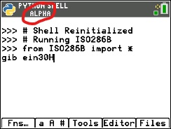
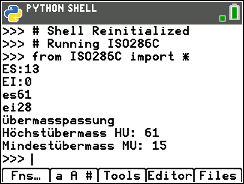

Zuerst musst du die folgenden Programme herunterladen und auf deinem Rechner hochladen.

    *ISO286B.py
    *ISO286C.py
    *ISO286W.py
    
Hier kannst du die TI Connect CE herunterladen, diese benötigst du um Programme von deinem PC auf dein Rechner zu übertragen
(https://education.ti.com/download/en/ed-tech/13312F7CEC074A2DAFD7EE5646129839/37C7F40B2BF34112B241535398308284/TIConnectCE-5.6.3.2278.exe)

Hier siehst du wie man das Programm bedient.
Zuerst kannst du mit dem Programm ISO286B die Abmasse der Bohrung berechnen. Dann kannst du mit dem Programm ISO286W die Abmasse von der Welle berechnen.

Damit du zwischen Gross- und Kleinbuchstaben wechseln kannst, musst du einfach zweimal die "alpha" Taste drücken.
Links oben siehst du dann auch einen Hinweis welcher Modus aktiv ist.

# Beispiel:
    Bohrung:    Ø30H6
    Welle:      Ø30r8

Du musst ISO286B starten und folgende Eingabe machen "30H6".

Dann musst du ISO286W starten und folgende Eingabe machen "30r8".

Zum Schluss kannst du noch ISO286C starten und die Werte, die du zuvor bekommen hast hier eingeben.
Damit wird dir gezeigt ob es sich um eine Spielpassung, Übergangspassung oder eine Übermasspassung handelt und wie gross die Werte sind.

**_Die Programme sind noch in Entwickung und wurden noch nicht gepenetrationstestet._** 
