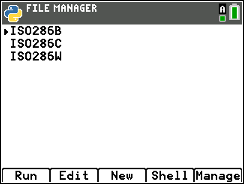
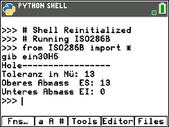
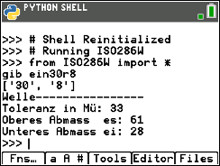

Zu erst musst du die Folgeenden Programme herunterladen und auf deinem Rechner hochladen.

    *ISO286B.py
    *ISO286C.py
    *ISO286W.py
    
Hier kannst du TI Connect CE herunter laden dies benögits du um Programe von deinem PC auf dein Rechner zu üertragen
(https://education.ti.com/download/en/ed-tech/13312F7CEC074A2DAFD7EE5646129839/37C7F40B2BF34112B241535398308284/TIConnectCE-5.6.3.2278.exe)

Hier sihst du wie man dan das Programm bedint.
Zu erst kannst du mit dem Programm ISO286B die Abmasse der Bohrung berechnen und darauf kanst du dan mit dem Programm ISO286W die Abmasse von der Welle berechnen.

Damit du Zwischen Gross und Klein Buchstaben wechseln kannst, kannst du einfach zwei mal die "alpha" taste drücken.
Links oben sihst du dan auch ein hinweiss welcher modus Aktiv ist.!

Hier sihst du noch das gleiche mit dem Programm ISO286W für die Welle.

